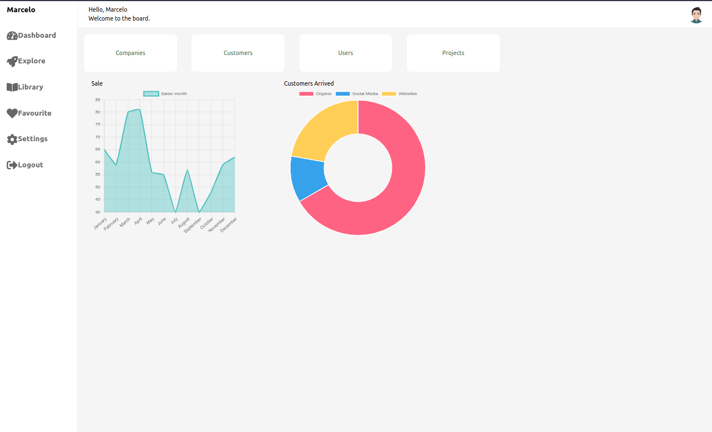
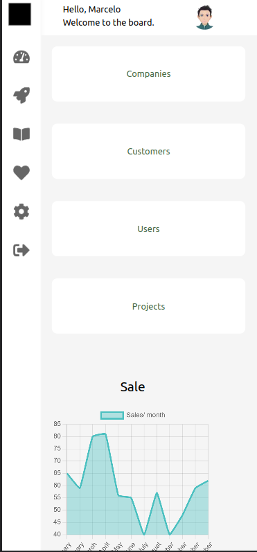

# Responsive Dashboard Design

Responsive dashboard design with Next.js using TailwindCSS (Dashboard responsivo usando ReactJS criado em Next.js e estilos usando TailwindCS - originalmente o estilo foi criado em CSS).

---

<table>
  <tr>
    <td></td>
    <td></td> 
  </tr>
 </table>

---

Reproduzido do canal Streamline - youtube.com
